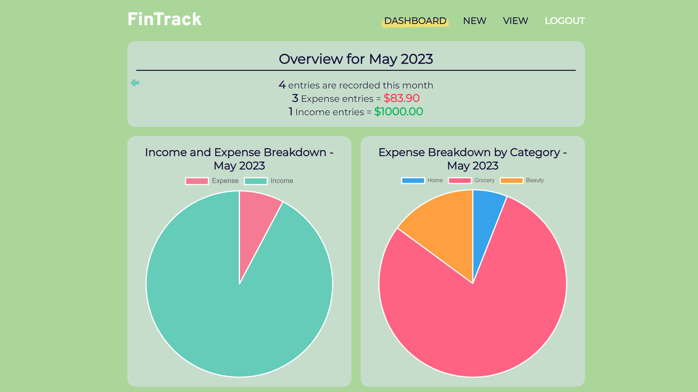

# FinTrack :dollar:

FinTrack is an expense and income tracking app designed to help users effectively oversee their financial activities and spending habits. It lets you categorize your expenses and income, so that you can keep track of your spending and earnings in an organized manner.

- [Live Demo Here](https://fintrack-live.web.app/)

## Screenshots
Dashboard 

Create entry (mobile design) 

View single entry (mobile design) 

View all/ filter entries (mobile design) 

## Features

- Record your income and expenses to keep track of your financial transactions
- Categorize your entry for better organization and to get a better understanding of your spending habits
- Edit and delete entries as needed
- Get an overview of your total income and expenses for the month from the dashboard
- View visualizations of your spending habits to help you identify areas for improvement
- Easily find specific transactions by searching and filtering based on various criteria

## Usage

To use the FinTrack App, simply follow these steps:

1. Create an account or log in with your existing account.
2. <u>New Page</u>: Record your income and expenses by entering the amount, date, and category.
3. <u>Dashboard Page</u>: Get a quick overview of your finances and the visualizations to identify areas where you can improve.
4. <u>View Page</u>: Use the search and filter functionality to find specific entries based on criteria such as date or category.
5. <u>Entry Page</u>: Edit or delete a specific entry.

## Built with

- HTML
- CSS
- Sass
- React
- React Router
- Typescript
- Firebase
- moment.js
- Chart.js
- react-chartjs-2
